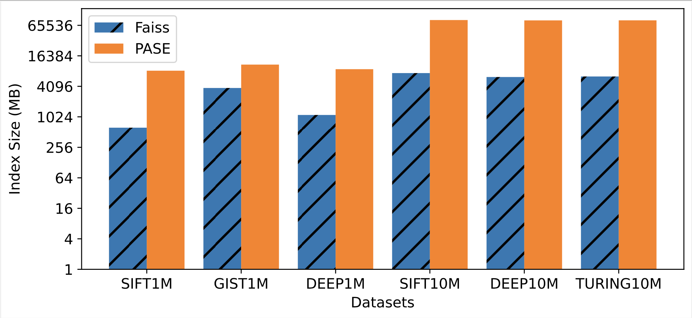
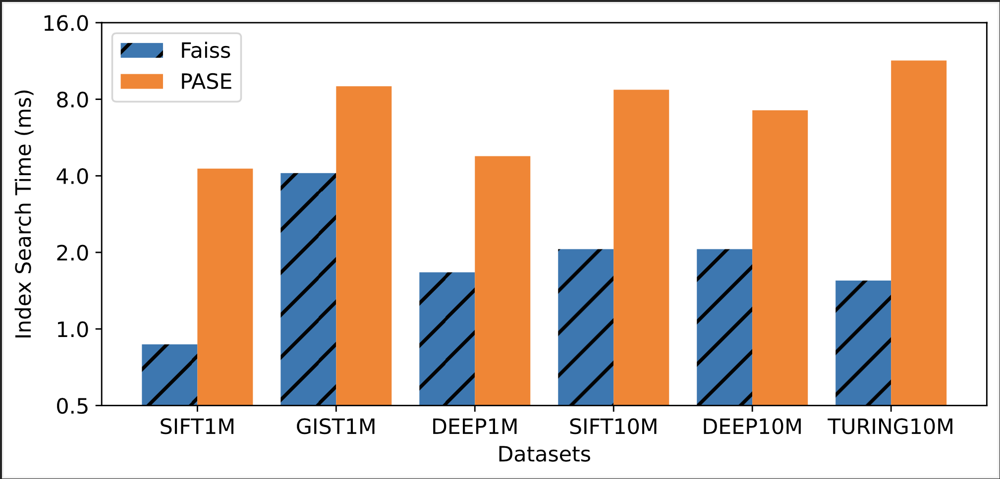

# Specialized vs. Generalized Vector Databases: How Different Are They Really?
High-dimensional vector data is becoming increasingly important in data science and AI applications. As a result, different database systems are built for managing vector data recently. Those systems can be broadly classified into two categories: specialized and gener- alized vector databases. Specialized vector databases (e.g., Facebook Faiss, Milvus, Microsoft SPTAG, Pinecone) are developed and op- timized explicitly and specifically for storing and querying vector data, while generalized vector databases (e.g., Alibaba PASE and AnalyticDB-V) support vector data management inside a relational database such as PostgreSQL. However, it is not clear about the performance comparison between the two approaches, and more importantly, what causes the performance gap. In this work, we present a comprehensive experimental study to systematically com- pare the two approaches in terms of index construction, index size, and query processing on a variety of real-world datasets. We drill down the underlying reasons that cause the performance gap and analyze whether the gap is bridgeable. Finally, we provide lessons and directions for building future vector databases that can simulta- neously achieve high performance and generality to serve a broad spectrum of applications.

# About This Repository
This repository contains code used for comparing performance of PASE and Faiss. PASE is in `postgresql-11.0/contrib/pase`. Faiss is in `faiss`.

# Prerequisite

OpenMP 4.0.1

# Getting the Source
`git clone https://github.com/Anonymous-Vec/Vec-Exp.git`

## How to use PASE

### Start PostgreSQL

#### Checking the Required Environment

`sudo apt-get install build-essential libreadline-dev zlib1g-dev flex bison libxml2-dev libxslt-dev libssl-dev libxml2-utils xsltproc ccache`

`cd postgresql-11.0`

#### Configure

`mkdir build`

`./configure --prefix=$build CFLAGS="-O3" LDFLAGS="-fPIC -fopenmp" `

#### Compile
`make`

`make install`


#### Initial new cluster named "data" on a folder:

`build/bin/initdb -D data`

#### Set the size of shared buffer in postgresql-11.0/build/data/postgresql.conf/:
`shared_buffers = 160GB`

### Start PASE

`cd contrib/PASE`

#### May need to change the Makefile:
`PG_CONFIG=postgresql-11.0/build/bin/pg_config`
#### Compile the PASE
`make USE_PGXS=1`
`make install`
	
#### Start the cluster:
`build/bin/pg_ctl -D data start` 
#### Create a database named "pasetest"
`postgresql-11.0/build/bin/createdb -p 5432 pasetest`
#### Connect the database
`postgresql-11.0/build/bin/psql -p 5432 pasetest`

### EXAMPLE CODE
#### In psql command line

`create extension pase;`

##### Create table

`CREATE TABLE vectors_ivfflat_test ( id serial, vector float4[]);`

```
INSERT INTO vectors_ivfflat_test SELECT id, ARRAY[id
       ,1,1,1,1,1,1,1,1,1,1
       ,1,1,1,1,1,1,1,1,1,1
       ,1,1,1,1,1,1,1,1,1,1
       ,1,1,1,1,1,1,1,1,1,1
       ,1,1,1,1,1,1,1,1,1,1
       ,1,1,1,1,1,1,1,1,1,1
       ,1,1,1,1,1,1,1,1,1,1
       ,1,1,1,1,1,1,1,1,1,1
       ,1,1,1,1,1,1,1,1,1,1
       ,1,1,1,1,1,1,1,1,1,1
       ,1,1,1,1,1,1,1,1,1,1
       ,1,1,1,1,1,1,1,1,1,1
       ,1,1,1,1,1,1,1,1,1,1
       ,1,1,1,1,1,1,1,1,1,1
       ,1,1,1,1,1,1,1,1,1,1
       ,1,1,1,1,1,1,1,1,1,1
       ,1,1,1,1,1,1,1,1,1,1
       ,1,1,1,1,1,1,1,1,1,1
       ,1,1,1,1,1,1,1,1,1,1
       ,1,1,1,1,1,1,1,1,1,1
       ,1,1,1,1,1,1,1,1,1,1
       ,1,1,1,1,1,1,1,1,1,1
       ,1,1,1,1,1,1,1,1,1,1
       ,1,1,1,1,1,1,1,1,1,1
       ,1,1,1,1,1,1,1,1,1,1
       ,1,1,1,1,1
       ]::float4[] FROM generate_series(1, 50000) id;
```

##### Build index

```
CREATE INDEX v_ivfflat_idx ON vectors_ivfflat_test
       USING
         pase_ivfflat(vector)
  WITH
    (clustering_type = 1, distance_type = 0, dimension = 256, clustering_params = "10,100");
```

##### Search index

```
SELECT vector <#> '31111,1,1,1,1,1,1,1,1,1,1,1,1,1,1,1,1,1,1,1,1,1,1,1,1,1,1,1,1,1,1,1,1,1,1,1,1,1,1,1,1,1,1,1,1,1,1,1,1,1,1,1,1,1,1,1,1,1,1,1,1,1,1,1,1,1,1,1,1,1,1,1,1,1,1,1,1,1,1,1,1,1,1,1,1,1,1,1,1,1,1,1,1,1,1,1,1,1,1,1,1,1,1,1,1,1,1,1,1,1,1,1,1,1,1,1,1,1,1,1,1,1,1,1,1,1,1,1,1,1,1,1,1,1,1,1,1,1,1,1,1,1,1,1,1,1,1,1,1,1,1,1,1,1,1,1,1,1,1,1,1,1,1,1,1,1,1,1,1,1,1,1,1,1,1,1,1,1,1,1,1,1,1,1,1,1,1,1,1,1,1,1,1,1,1,1,1,1,1,1,1,1,1,1,1,1,1,1,1,1,1,1,1,1,1,1,1,1,1,1,1,1,1,1,1,1,1,1,1,1,1,1,1,1,1,1,1,1,1,1,1,1,1,1,1,1,1,1,1,1,1,1,1,1,1,1'::pase as distance
    FROM vectors_ivfflat_test
    ORDER BY
    vector <#> '31111,1,1,1,1,1,1,1,1,1,1,1,1,1,1,1,1,1,1,1,1,1,1,1,1,1,1,1,1,1,1,1,1,1,1,1,1,1,1,1,1,1,1,1,1,1,1,1,1,1,1,1,1,1,1,1,1,1,1,1,1,1,1,1,1,1,1,1,1,1,1,1,1,1,1,1,1,1,1,1,1,1,1,1,1,1,1,1,1,1,1,1,1,1,1,1,1,1,1,1,1,1,1,1,1,1,1,1,1,1,1,1,1,1,1,1,1,1,1,1,1,1,1,1,1,1,1,1,1,1,1,1,1,1,1,1,1,1,1,1,1,1,1,1,1,1,1,1,1,1,1,1,1,1,1,1,1,1,1,1,1,1,1,1,1,1,1,1,1,1,1,1,1,1,1,1,1,1,1,1,1,1,1,1,1,1,1,1,1,1,1,1,1,1,1,1,1,1,1,1,1,1,1,1,1,1,1,1,1,1,1,1,1,1,1,1,1,1,1,1,1,1,1,1,1,1,1,1,1,1,1,1,1,1,1,1,1,1,1,1,1,1,1,1,1,1,1,1,1,1,1,1,1,1,1,1'::pase
     ASC LIMIT 10;
```


### Original PASE Code:

- [Pase: PostgreSQL Ultra-High Dimensional Approximate Nearest Neighbor Search Extension](https://github.com/alipay/PASE)

## How to use Faiss

### Prerequisite
`sudo apt install intel-mkl`

`sudo apt-get install -y libopenblas-dev` 

### Compile and build:
`cd faiss`

`cmake -B build . -DFAISS_ENABLE_GPU=OFF -DFAISS_ENABLE_PYTHON=OFF -DCMAKE_BUILD_TYPE=Release -DFAISS_OPT_LEVEL=generic `

`make -C build -j faiss`  

`sudo make -C build install` 

`make -C build 2-IVFFlat`

### Run the example code:
`./build/tutorial/cpp/2-IVFFlat` 

### Original Faiss Code:

- [Faiss: A Library for Efficient Similarity Search and Clustering of Dense Vectors](https://github.com/facebookresearch/faiss)

# Comparison Results

## EVALUATING INDEX CONSTRUCTION


## EVALUATING INDEX SIZE




## EVALUATING SEARCH PERFORMANCE





# Summary

This work investigates the performance difference between specialized vector databases and generalized vector databases. Based on the experimental results, there is still a significant performance gap between the two approaches. In particular, specialized vector databases (e.g., Faiss) can outperform generalized vector databases (e.g., PASE) by an order of magnitude or even more depending on different scenarios, indexes, and datasets.

We summarize the root causes of the performance gap as follows and discuss how to bridge the gap:

RC#1: SGEMM Optimization.

RC#2: MemoryManagement.

RC#3: Parallel Execution.

RC#4: Disk-centric Page Structure.

RC#5: K-means Implementation.

RC#6: Top-k Evaluation in SQL.

RC#7: Precomputed Table.


Overall Message. The overall conclusion of this work is that, for now, generalized vector databases are still much slower than spe- cialized vector databases. Thus, we recommend specialized vector databases for applications that need to manage vector data. How- ever, we see a large room for improvement for generalized vector databases. In the long term, we are still positive that generalized vector databases can be improved up to the speed.